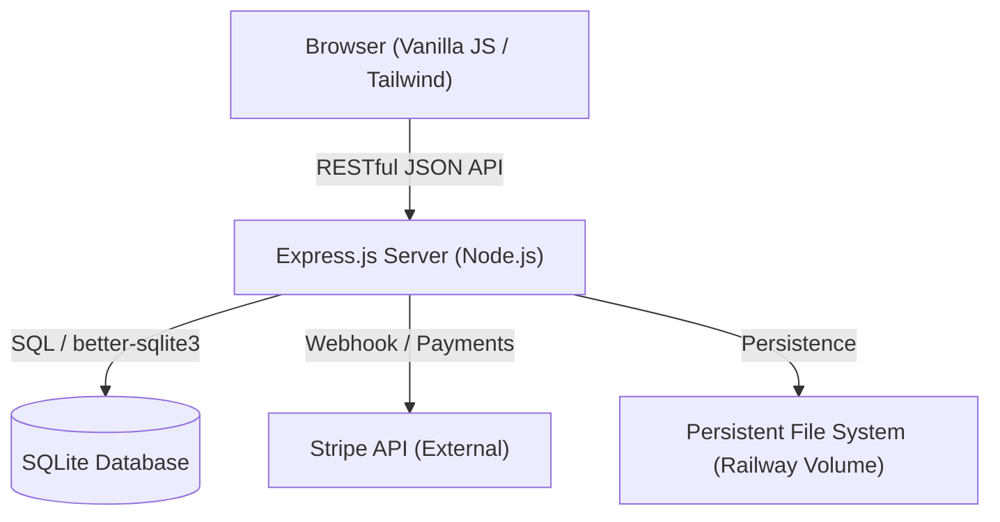
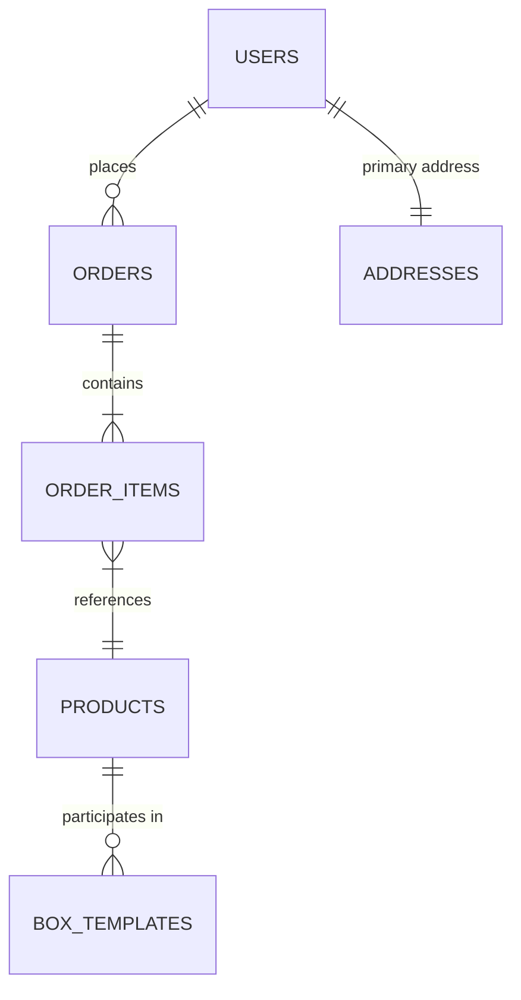

# Driftless Harvest: Engineering Specification & Architecture Suite

This document serves as the authoritative technical specification for the Driftless Harvest platform. It provides deep architectural insights, engineering patterns, and the operational roadmap required to maintain a premium, secure, and performant artisanal marketplace.

---

## 1. System Architecture & Design Philosophy

### 1.1 Architectural Overview (C4 Container Model)
The Driftless Harvest platform follows a decoupled, monolithic architecture designed for simplicity, observability, and high-fidelity user experiences.



### 1.2 Design Philosophy
*   **The Product is the Hero**: Technical interfaces are minimalist, using "Organic Modernism" to emphasize high-quality photography.
*   **Boutique Performance**: Heavy frameworks are avoided. Vanilla JavaScript and Tailwind CSS provide near-instant load times and smooth micro-interactions.
*   **Operational Simplicity**: SQLite is used for local persistence, eliminating the overhead of managing a separate database server while providing ACID compliance.

---

## 2. API Engineering Specification

### 2.1 Communication Protocol
All communication between the client and server is conducted over HTTPS using RESTful patterns and JSON payloads.

**Base URL**: `/api`
**Authentication**: JWT-based Bearer Token in `Authorization` header.

### 2.2 Core Endpoint Matrix

| Category | Method | Endpoint | Description | Auth |
| :--- | :--- | :--- | :--- | :--- |
| **Orders** | `GET` | `/admin/orders` | Retrieve comprehensive order history. | Admin |
| | `PUT` | `/admin/orders/:id` | Atomic update of order state/items. | Admin |
| | `POST` | `/admin/sync-payment/:id` | Direct synchronization with Stripe status. | Admin |
| **Inventory** | `GET` | `/admin/products` | Retrieve current stock levels and metadata. | Admin |
| | `PUT` | `/admin/products/:id` | Real-time adjustment of inventory levels. | Admin |
| **Users** | `GET` | `/admin/users` | Holistic user management. | Super Admin |
| **Public** | `POST` | `/auth/login` | Secure administration entry. | Public |
| | `POST` | `/orders` | High-integrity order placement flow. | Public |

### 2.3 Authentication Lifecycle
The system implements a stateless JWT authentication strategy.
1.  **Issue**: Upon successful login, the server issues a JWT signed with a high-entropy secret.
2.  **Persistence**: The client stores the token in `localStorage` (Mitigation: XSS hardening required).
3.  **Verification**: Middleware extracts and verifies the token on protected routes, injecting the `user` object into the request context.

---

## 3. Data Architecture & Persistence

### 3.1 Entity Relationship Diagram (ERD)
The schema is optimized for lookup speed and transactional integrity.



### 3.2 Strategic Data Roadmap: Repository Pattern
To eliminate SQL sprawl and prepare for potential PostgreSQL migration, the system is moving towards the **Repository Pattern**.

**Proposed Interface**:
```javascript
class UserRepository {
    async findById(id) { ... }
    async findByEmail(email) { ... }
    async create(userData) { ... }
    async update(id, userData) { ... }
}
```

### 3.3 Transactional Integrity
Multi-table operations (e.g., checkout) must be wrapped in explicit `db.transaction()` blocks to ensure atomicity. This prevents orphaned records (e.g., a payment record without corresponding order items).

---

## 4. Security Posture & Operational Excellence

### 4.1 Threat Model & Hardening Roadmap
The following vulnerabilities have been identified and are currently tracked for remediation:

| ID | Vulnerability | Classification | Remediation Status |
| :--- | :--- | :--- | :--- |
| **SEC-01** | IDOR on Order Updates | **CRITICAL** | Implementation of ownership validation middleware. |
| **SEC-02** | Stored XSS in Admin View | **HIGH** | Migration from `innerHTML` to `textContent`/Sanitization. |
| **SEC-03** | Hardcoded JWT Fallback | **MEDIUM** | Enforcement of environment variables via startup checks. |

### 4.2 Observability & Reliability
*   **Logging**: Moving from standard `console` output to structured logging (Winston) for persistent auditing.
*   **Error Handling**: Implementation of a Global Error Handler middleware to prevent sensitive leakages and allow graceful recovery.
*   **Input Validation**: Enforcing Zod schemas across all API entry points to prevent malformed data injection.

---

## 5. DevOps & Infrastructure Strategy

### 5.1 Deployment Architecture
Leveraging **Railway** for persistent volume management.
*   **Persistent Storage**: `/app/data` is mounted as a volume to ensure SQLite database longevity across deployments.
*   **Environmental Parity**: `.env.example` provides the authoritative list of required configurations (`PORT`, `ADMIN_PASSWORD`, `STRIPE_SECRET_KEY`).

### 5.2 CI/CD Philosophy
The project prioritizes "Boutique CI" — focusing on high-impact automated verification for critical paths (Checkout, Inventory Management) while maintaining a fast iteration cycle for design elements.

---

## 6. Design System & Frontend Engineering

### 6.1 Runtime Theming Engine
The platform implements a unique **Reactive Theming System** using CSS variable injection and Tailwind runtime configuration.

**Theme Spectrum**:
*   `Nature`: Modern, high-legibility standard.
*   `Heritage`: High-texture, serif-heavy artisanal aesthetic.
*   `Journal`: Editorial focus for CSA storytelling.
*   `Sketch`: High-personality "hand-drawn" layout.

### 6.2 Component Architecture: Bento Grid
The `BentoGrid.js` module implements an adaptive, non-linear layout engine for featured products, ensuring visual interest regardless of item count or aspect ratio.

---

*This document is maintained as a living technical record. All architectural changes must be reflected here immediately upon implementation.*
